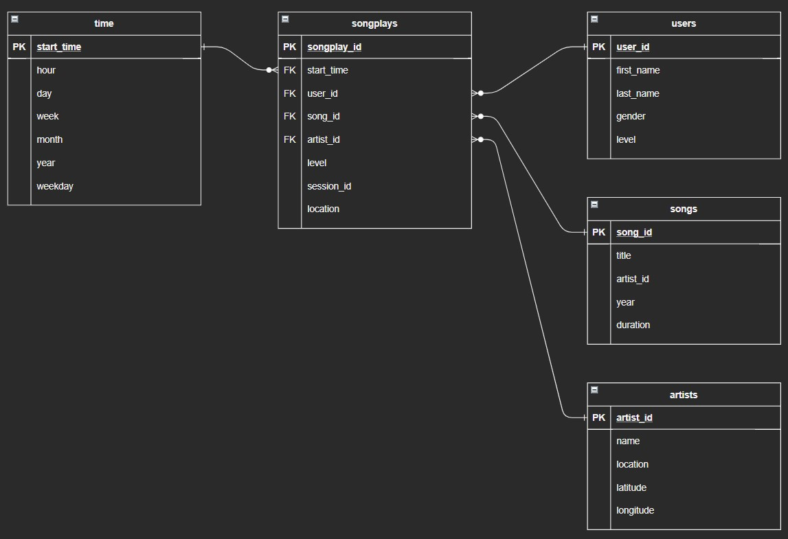

# The Sparkify ETL Pipeline

Sparkify is an up-and-coming music streaming platform that is (pardon the pun) hitting all the right notes in the tech and music industry. We are building an ETL pipeline for them that will extract song, artist, and log data from JSON files and load the data into their postgresql database. Once this process is complete, Sparkify data analysts will be able to explore the data and gain insights about how the platform's users interact with the app, and which songs and artists they listen to.

 

## The Sparkify Data Schema
The Sparkify data schema consists of 5 tables arranged in a Star Schema. The figure below is a representation of the schema:

The fact table is the `songplays` table. It references four dimension tables:
- `songs`
- `artists`
- `users`
- `time`

 

## Creating the Data Tables
The Sparkify data tables are created inside a database called `sparkifydb`. We connect to this database using python, through a python library called `psycopg2`. This library allows us to pass SQL commmands to the postgresql database within python scripts. The script `sql_queries.py` contains the main SQL commands for creating the five tables of the data schema (see the figure for reference), the foreign key constraints among the tables, and the commands for inserting data into the tables. Each command is stored as a string variable that can be passed to a `psycopg2` instance with a connection to our database.

Another script, `create_tables.py`, sets up the connection with the `sparkifydb` using `psycopg2` and passes the commands from `sql_queries.py` to the database. The script drops any existing data tables (a reset of the database, in effect), and then creates the tables.

 

## The ETL Pipeline
After the data tables are created, we perform the Extract, Transform, and Load part of the pipeline. 
The script that handles these steps is the aptly-named `etl.py`. 

### Extract
The raw data comes in the form of JSON files that contain song, artist, user, and songplay session data. The procedure for extracting the data from these JSON files is as follows:

For each JSON file `->` Convert JSON data to Pandas Dataframe `->` For each New Record in Pandas Dataframe `->` Append new record to a global Pandas Dataframe

Rather than INSERTing each new record into the postgresql database one at a time, I am creating a Pandas Dataframe for each data table. The columns of each dataframe matches the name and datatype of its respective data table. Each new record from each JSON file is appended to these dataframes. Then, after all JSON files have been processed, I will convert the dataframes into a CSV file in memory, and then COPY them into the postgres database. This is a bulk upload of the data.

### Transform
The data we extract from the JSON files needs to be cleaned up before we can load them into the database. There were two main issues with the data:

1. There are duplicate records. Our data tables use primary keys to insure the uniqueness of their records. Duplicate records would be rejected if we tried to upload them. As I noted in the Extract stage, I pull data records from JSON files and store them in Pandas Dataframes. There is one dataframe for each data table. Using Pandas' `drop_duplicates()` function, we can drop duplicate records under the column that is the primary key.

2. Mixed data types. There are certain data attributes that are of type `int` or `numeric`. When we read JSON data into the Pandas Dataframe, they may contain a mix of data types. The most common example is records of type string, int, and float getting mixed together in one column. To maintain data consistency, we should enforce that int/numeric columns only contain int/numeric values. Again, Pandas has built-in functions that allow us to do this.

3. NULL values. The Songplays data table must query the song and artist id data from the songs and artists tables. For this project, there was only one match returned. Therefore, all the other song_id, artist_id values in Songplays are NULL. Yet, there are no NULL records in either songs or artists. Since there is a foreign key constraint between songplays and songs, and between songplays and artists, a constraint violation error will occur. To remedy this, we simply added one NULL record to songs and artists. This is temporary remedy, and a more professional solution should be developed.

### Load
At this stage, all records have been extracted from JSON files and stored in Pandas Dataframes. Duplicate records are removed, data types are consistent, and foreign key constraints are met. We now convert the Dataframes into a CSV file, in memory, using the `StringIO` python library. The function `copy_from_stringio` takes each Dataframe and writes it to memory. Then, using `psycopg2`'s `copy_from()` function, we can load the dataframe data to its respective data table in bulk. There is one nuance here: CSV data are normally comma-separated. However, the records for songplays contain strings with commas in them. This will be interpreted as separate columns. To work around this issue, when we write the Dataframe to CSV, we specify that the separator be tab. Then when we copy the data from CSV into tables, we also specifcy that the separator be tab. This resolved the issue.

## Check the Results
After we run `etl.py` with no errors, we use the `test.ipynb` notebook to look at our database. There are a series of commands that allow us to pass SQL commands directly to the database. We focus on checking the head of the data tables, and the counts, to make sure we have the expected columns, data, and number of records.

